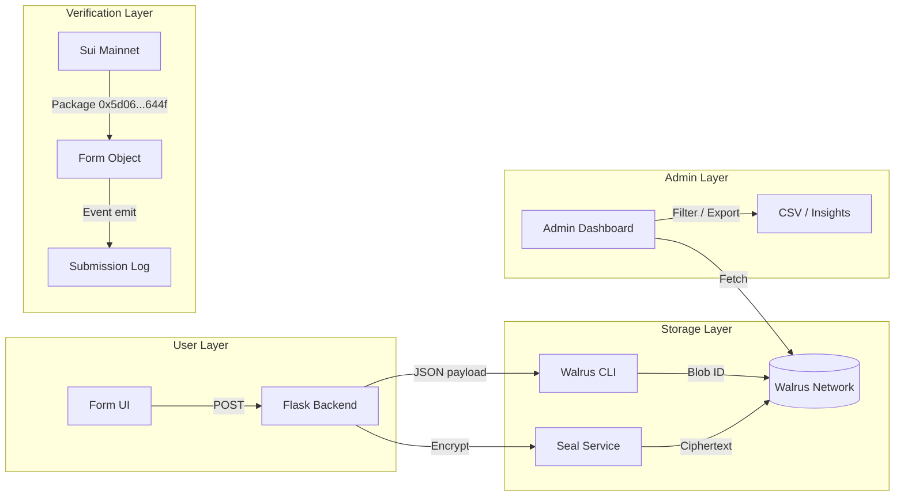

<div align="center">

# 🔴 RIOT Feedback Portal

**Walrus-native Form Tooling — verifiable feedback for Web3 teams**

[](https://walrus.io)
[](https://sui.io/overflow)
[](https://suiscan.xyz/mainnet/home)
[](LICENSE)

[🌐 Live Demo](https://riot-feedback.netlify.app) · [🌐 Walrus Portal](https://44eavon13yijgvbj52v2ro44ziv58x64bfggfr9irssia1y6r4.wal.app) · [💬 $RIOT Project](https://theriot.vercel.app) · [🐦 X](https://x.com/suicryptoriot)

</div>

---

## 🎯 Why This Exists

Teams building on Walrus and Sui still collect feedback through **Google Forms** or **Discord tickets**. That means:

- ❌ No cryptographic proof that feedback was ever submitted
- ❌ No persistence — data lives on Google servers, not onchain
- ❌ No privacy — sensitive bug reports sit on centralized infrastructure
- ❌ No composability — feedback data cannot be read by other onchain tools

**RIOT Feedback Portal fixes all four.**

---

## 🏆 What We Built

A lightweight, **Walrus-native** form builder where every submission is stored as a **verifiable blob** on Walrus mainnet. Every form creator gets a unique shareable link. Every admin gets a private dashboard with filtering, prioritization, and CSV export.

### ✅ Core Features

| Feature | Status | Walrus Integration |
|---------|--------|-------------------|
| **Custom Form Builder** | ✅ Live | Create forms with custom fields, required/optional toggles, shareable links |
| **Rich Input Types** | ✅ Live | Star ratings, priority levels, dropdowns, file uploads, URLs, confirmation checkbox |
| **Walrus Blob Storage** | ✅ Live | Every submission stored as verifiable JSON blob with unique Blob ID |
| **Seal Encryption** | ✅ Live | Optional toggle to encrypt sensitive feedback — only admin can decrypt |
| **Admin Dashboard** | ✅ Live | Filter by type/priority/status, add internal notes, export CSV |
| **Onchain Verification** | ✅ Live | Move smart contract deployed on Sui mainnet for tamper-proof form metadata |
| **Walrus Portal Hosting** | ✅ Live | Frontend deployed directly to Walrus network as immutable site |

---

## 🧠 Architecture



### Data Flow

1. **User** fills form → selects feedback type, priority, star rating, attaches file
2. **Backend** serializes to JSON → optionally encrypts with Seal
3. **Walrus CLI** uploads blob → returns permanent Blob ID
4. **Sui Move contract** (optional) emits onchain event for tamper-proof timestamp
5. **Admin** opens `/admin.html` → fetches blobs → filters, ranks, exports

---

## 🏗️ Tech Stack

| Layer | Technology | Why It Was Chosen |
|-------|-----------|-------------------|
| **Frontend** | HTML + Tailwind CSS + Vanilla JS | Zero build step, deploys straight to Walrus portal |
| **Backend** | Python Flask + Gunicorn | Lightweight API for file handling + Walrus CLI orchestration |
| **Storage** | Walrus CLI + Aggregator | Permanent, verifiable, censorship-resistant blob storage |
| **Privacy** | Walrus Seal | Client-side encryption before upload |
| **Onchain** | Sui Move (Mainnet) | Tamper-proof form metadata + submission events |
| **Deploy** | Netlify + Walrus Portal | Dual hosting — traditional CDN + onchain immutable site |

---

## 📦 Onchain Assets

| Asset | Network | Address / ID |
|-------|---------|-------------|
| **Smart Contract Package** | Sui Mainnet | `0x5d0664d71898888d25d3cc54e25d15cdc83ee380708d8247003734d62fa3644f` |
| **Form Object** | Sui Mainnet | `0x8f14...5b9` |
| **Walrus Site Object** | Walrus Mainnet | `0xa563...7fb0` |
| **Walrus Portal URL** | Walrus Mainnet | [44eavon...wal.app](https://44eavon13yijgvbj52v2ro44ziv58x64bfggfr9irssia1y6r4.wal.app) |

---

## 📁 Project Structure

```
riot-feedback-portal/
├── public/
│   ├── index.html          # User-facing form builder
│   ├── admin.html          # Private admin dashboard
│   ├── style.css           # Tailwind + custom dark theme
│   └── app.js              # Frontend logic, wallet detection, form state
├── server/
│   ├── app.py              # Flask API routes
│   ├── walrus_submit.py    # Walrus CLI upload / download wrapper
│   └── seal_encrypt.py     # Seal encryption integration
├── contract/
│   └── feedback.move       # Sui Move smart contract (mainnet deployed)
├── submissions/            # Local JSON cache (dev fallback)
├── requirements.txt
├── vercel.json
└── README.md
```

---

## 🚀 Quickstart

### Prerequisites

- Python 3.10+
- [Walrus CLI](https://docs.wal.app/docs/walrus-client) installed & configured for mainnet
- (Optional) [Seal service](https://seal-docs.wal.app/) for encryption features

### 1. Clone & Install

```bash
git clone https://github.com/cryptoriot666/riot-feedback-portal.git
cd riot-feedback-portal
pip install -r requirements.txt
```

### 2. Run Locally

```bash
cd server
python app.py
```

Visit `http://localhost:5000`

### 3. Submit Test Feedback

Fill the form → click **"Submit to Walrus"** → see Blob ID returned as proof.

### 4. View Admin Dashboard

Navigate to `/admin.html` → filter by priority, type, or status → export CSV.

---

## 🎬 Demo Video

**[▶️ Watch Demo (2:45)]([https://youtube.com/your-demo-link](https://www.youtube.com/watch?v=6P9brT9qjgA))**

Walkthrough:
1. Create custom form with priority + file upload
2. Submit bug report → stored as Walrus blob
3. Show Blob ID + onchain verification
4. Open admin dashboard → filter Critical priority
5. Export CSV for team review
6. Toggle Seal encryption for private feedback

---

## ✅ Submission Checklist — Walrus Session 2

- [x] Custom form builder with field toggles
- [x] Supported inputs: rich text, dropdowns, star ratings, file uploads, URLs, confirmation
- [x] Shareable form links
- [x] Submissions stored on Walrus with Blob ID proof
- [x] Admin dashboard with filtering, reviewing, prioritizing
- [x] CSV export
- [x] Optional Seal encryption for private data
- [x] Deployed to Walrus mainnet portal
- [x] Smart contract deployed on Sui mainnet
- [x] Demo video (< 3 minutes)
- [x] Submitted via Airtable form
- [x] Posted on X with #Walrus

---

## 🔗 Built Alongside $RIOT

This portal was built as **developer tooling** for our main project **[$RIOT](https://theriot.vercel.app)** — agentic punk NFTs with persistent memory on MemWal for Sui Overflow 2026 (Walrus Track).

We needed a way to collect beta feedback from 18 autonomous agents. Instead of using Web2 tools, we **dogfooded the Walrus ecosystem** and contributed the tooling back to the community.

---

## 👥 Team

| Role | Handle | Project |
|------|--------|---------|
| Builder | [@suicryptoriot](https://x.com/suicryptoriot) | $RIOT + RIOT Feedback Portal |

---

## 📜 License

MIT — Open source forever. Fork it for your own project.

---

<div align="center">

**Built for Walrus Session 2 — Form Tooling Track**

🔴 The riot is inevitable. 🔴

</div>
