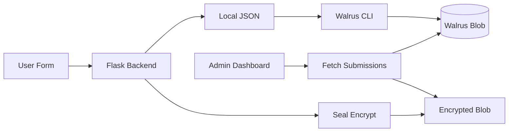

<div align="center">

# 🔴 RIOT Feedback Portal

**Walrus-native feedback & form platform for agentic projects**

[](https://walrus.io)
[](https://sui.io/overflow)
[](LICENSE)

[🌐 Live Demo](https://your-vercel-url.vercel.app) · [💬 $RIOT Project](https://theriot.vercel.app) · [🐦 X](https://x.com/suicryptoriot)

</div>

---

## 🧠 Problem

Teams building on Walrus still use **Google Forms** or **Discord DMs** to collect bug reports, feature requests, and surveys. The data is:

- ❌ **Scattered** across platforms — hard to track and prioritize
- ❌ **Not verifiable** — no proof of when or what was submitted
- ❌ **Not persistent** — disappears when the tool changes or account closes
- ❌ **Not private** — sensitive feedback (security bugs, tokenomics) sits on centralized servers

## 🔥 Solution

A lightweight, **Walrus-native** form builder where every submission is stored as a **verifiable blob** on Walrus. Optional **Seal encryption** for private feedback.

### Key Features

- ✅ **Custom Form Builder** — text, dropdown, star rating, file upload, priority levels
- ✅ **Walrus Storage** — every submission stored as JSON blob with unique Blob ID
- ✅ **Seal Privacy** — encrypt sensitive feedback so only admin can decrypt
- ✅ **Admin Dashboard** — filter, review, prioritize, and export CSV
- ✅ **Shareable Links** — each form has a unique URL for distribution
- ✅ **Built for Ecosystem** — designed alongside [$RIOT](https://theriot.vercel.app), our agentic NFT project for Sui Overflow

---

## 🏗️ Architecture



### Data Flow

1. User fills form (project, type, priority, message, attachment)
2. Backend saves JSON locally + attempts Walrus upload
3. If `encrypt` checked → Seal encrypts payload before storage
4. Returns Blob ID to user as proof of submission
5. Admin dashboard fetches all blobs from Walrus aggregator
6. Admin filters by type/priority, reviews details, exports CSV

---

## 🛠️ Tech Stack

| Layer | Technology | Purpose |
|-------|-----------|---------|
| **Frontend** | HTML + Tailwind CSS + Vanilla JS | Form builder + Admin dashboard |
| **Backend** | Python Flask | API + file handling |
| **Storage** | Walrus CLI | Blob persistence |
| **Privacy** | Seal (placeholder) | Optional encryption |
| **Deploy** | Vercel / Railway / Local | Hosting |

---

## 📁 Project Structure

```
riot-feedback-portal/
├── public/
│   ├── index.html          # User-facing form
│   ├── admin.html          # Admin dashboard
│   ├── style.css           # Tailwind + custom styles
│   └── app.js              # Frontend logic
├── server/
│   ├── app.py              # Flask API
│   ├── walrus_submit.py    # Walrus upload/download
│   └── seal_encrypt.py     # Seal integration placeholder
├── submissions/            # Local JSON cache (dev)
├── demo/
│   └── video.mp4           # Demo video for submission
├── requirements.txt
├── vercel.json
└── README.md
```

---

## 🚀 Quickstart

### Prerequisites

- Python 3.10+
- [Walrus CLI](https://docs.wal.app/docs/walrus-client) installed
- (Optional) [Seal service](https://seal-docs.wal.app/) for encryption

### 1. Clone & Install

```bash
git clone https://github.com/cryptoriot666/riot-feedback-portal.git
cd riot-feedback-portal
pip install -r requirements.txt
```

### 2. Run Locally

```bash
cd server
python app.py
```

Visit `http://localhost:5000`

### 3. Submit Test Feedback

Fill the form → click "Submit to Walrus" → see Blob ID returned.

### 4. View Admin Dashboard

Go to `/admin.html` → see all submissions with filter + export.

---

## 🎬 Demo Video

> **Coming soon:** 2-minute walkthrough for Walrus Session 2 submission.

Planned scenes:
1. Create custom form with priority + file upload
2. Submit bug report → stored as Walrus blob
3. Show Blob ID as proof
4. Open admin dashboard → filter by Critical priority
5. Export CSV for team review
6. Show Seal toggle for private feedback

---

## 🧪 Submission Checklist (Walrus Session 2)

- [x] Custom form builder (fields, required/optional inputs)
- [x] Supported inputs: rich text, dropdowns, star ratings, file uploads
- [x] Shareable form links
- [x] Walrus-based storage for submissions
- [x] Admin dashboard for filtering, reviewing, prioritizing
- [x] CSV export
- [x] Optional Seal encryption for private data
- [ ] Demo video (< 3 minutes) on Walrus
- [ ] At least one real feedback submission
- [ ] Submit via Airtable form

---

## 🔗 Connection to $RIOT

This portal was built **alongside** our main project [$RIOT](https://theriot.vercel.app) — agentic punk NFTs with persistent memory on MemWal for Sui Overflow 2026 (Walrus Track).

We needed a way to collect beta tester feedback for our 18 autonomous agents. Instead of using Google Forms, we built this tool to **dogfood the Walrus ecosystem** and contribute developer tooling back to the community.

---

## 👥 Team

| Role | Handle | Status |
|------|--------|--------|
| Builder | [@suicryptoriot](https://x.com/suicryptoriot) | ✅ Active |

---

## 📜 License

MIT — Open source forever. Fork it for your own project.

---

<div align="center">

**Built for Walrus Session 2 — Form Tooling**

🔴 The riot is inevitable. 🔴

</div>
